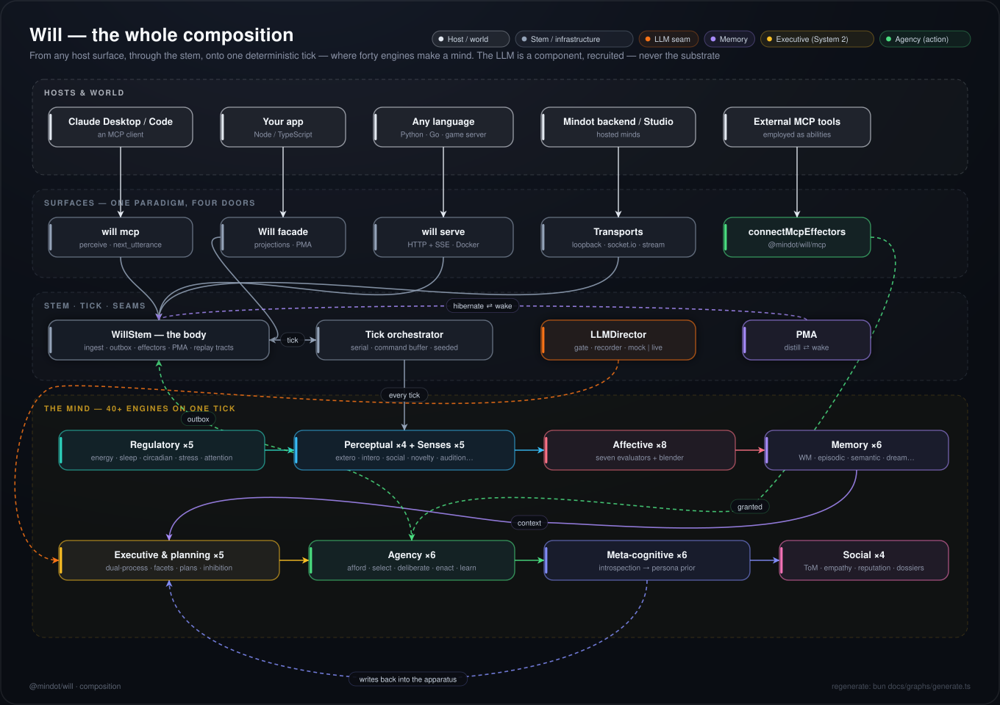

# Will — an engine for persistent machine minds

[](https://github.com/mindot-ai/will/actions/workflows/ci.yml)
[](LICENSE)

**A self-aware synthetic mind. Not a chatbot.**

Will is a persistent, autonomous agent built from **40+ cognitive engines** — 38 faculties across seven systems, a learning **agency pipeline**, and five sensory channels — all stepping forward in continuous real time. They regulate energy, sleep, emotion, memory, planning, social cognition, and self-reflection on a deterministic tick clock. An LLM is **one component**, not the substrate: it is recruited only when a moment is ambiguous or high-stakes. Most ticks resolve on the engines alone, without inference.

```
Regulatory → Perceptual → Affective → Memory → Executive → Meta-cognitive → Social
                                              ↓
                                    ExecutiveEngine (LLM)
              recruited only when ambiguous / high-stakes (System 2)
                                              ↑
                  Meta-cognition writes back into the apparatus
              (introspection → persona-prior → engine configs, traits, salience)
```

The mind is not re-derived from a prompt each run. It **accretes**: traits develop from experience, beliefs consolidate, skills proceduralise, and a coherent self carries across restarts as a portable, eval-verified artifact.

Embed it six ways — [**SDK facade**](#the-will-sdk-facade--recommended) (Node/TS) · [**Discord**](#a-will-in-your-discord-server--will-discord) (a mind in your server) · [**WhatsApp**](docs/channels/whatsapp.md) (QR-pair a linked device) · [**Claude Desktop via MCP**](#the-mcp-server--a-persistent-mind-in-claude-desktop--claude-code) · [**MCP tools as its abilities**](#employing-mcp-tools--the-mind-gets-abilities) · [**HTTP sidecar / Docker**](#the-http-sidecar--will-serve-any-language-or-docker) (any language). [Pick a surface →](#use-it-in-your-project)

---

## What makes it different

| Typical LLM agent | Will |
|---|---|
| Stateless per request | Continuous autonomous existence across ticks |
| Prompt → response | 40+ engines running every tick; the LLM synthesises their outputs only when recruited |
| Emotional state: a string in the prompt | Real affective system — eight evaluators blended into valence, arousal, dominance, attachment |
| Memory: retrieved chunks | Episodic consolidation, semantic belief integration, forgetting curve, spaced repetition, dream replay |
| Goals: hardcoded instructions | Dynamic goal manager — the Will creates, abandons, and reprioritises its own goals |
| Plans: a step dispatcher | Plans bias the *one* action competition as a top-down prior — no parallel command channel |
| Personality: a prompt string | Five-factor trait model that *develops* — traits self-tune from experience and carry a learned baseline across restarts |
| No self-improvement | A closing metacognition loop — introspection writes back into the engine apparatus (accommodation), bounded and surprise-gated |
| Token blowout at tick 600 | Context windowing — rolling summariser + isolated conversation threads |
| Fire-and-forget actions | Bidirectional effector ack loop — the host confirms execution; the result feeds back through reafference |
| Fixed effector catalog | Learning agency pipeline — actions are *found in the situation*, enacted, and proceduralised into composite skills via reafference |
| No identity across restarts | A portable, eval-verified mind artifact (PMA) — psychology **and** learned competence, with a measured reconstruction-fidelity score |

---

## Quick start — a mind in 60 seconds, no API key

```bash
git clone https://github.com/mindot-ai/will.git
cd will
bun install
bun run examples/hello-will.ts
```

That boots a full mind with a deterministic mock executive — zero keys, zero cost —
ticks it, shows its internal state moving, sends it a message, and prints the reply:

```
⚡ Assembling a mind…
👁  Watching the mind tick…
tick  10 · energy 99.86 · stress 0.90 · valence 0.35 · curiosity 0.58

💬 You: "Hello! Who are you?"
🧠 Dot: "Hi! You said: "Hello! Who are you?" — I heard you, and I'm listening."

🔍 Inside the mind: 1 active goal(s)
   goal: Get to know whoever I meet
```

Then try:

```bash
bun run examples/persistence.ts       # kill a mind, resurrect it from its PMA — it remembers
ANTHROPIC_API_KEY=sk-ant-… \
  bun run examples/with-anthropic.ts  # a real executive: genuine reasoning + replies
```

Requires [Bun](https://bun.sh) ≥ 1.1. For a real executive set a provider, a model and a
key — `WILL_LLM_PROVIDER=anthropic` + `WILL_LLM_MODEL=claude-sonnet-4-5-20250929` +
`ANTHROPIC_API_KEY`. All three are required and none is guessed: [a dozen providers are
first-class](#llm-provider), and a default here would send your key to the wrong one. The dev
runner (`bun dev`) starts a long-lived Will: engines step every `WILL_TICK_MS` on the
deterministic clock; the ExecutiveEngine fires an LLM call every `WILL_EXECUTIVE_INTERVAL`
ticks — or earlier when physiology demands it.

---

## Use it in your project

Runs anywhere **Node 18+ or Bun** runs (the engine is Node-compatible; Bun is the primary target). **Six surfaces**, one paradigm — you *perceive* things to a mind and *observe what it projects*; it may act, speak, or stay silent, and it persists across restarts via its [PMA artifact](#pma--the-persistent-mind-artifact):

| Surface | You are… | Start with |
|---|---|---|
| [**SDK facade**](#the-will-sdk-facade--recommended) | a Node/TypeScript app embedding a mind | `import { Will } from '@mindot/will'` |
| [**Discord**](#a-will-in-your-discord-server--will-discord) | a server where a mind should *live* | `npx -y @mindot/will discord` |
| [**WhatsApp**](docs/channels/whatsapp.md) | the chats people actually check — via a QR-paired linked device (unofficial; read the guide's warning) | `npx -y @mindot/will whatsapp` |
| [**MCP host**](#the-mcp-server--a-persistent-mind-in-claude-desktop--claude-code) | Claude Desktop / Claude Code / an IDE | `npx -y @mindot/will mcp` |
| [**MCP tools as abilities**](#employing-mcp-tools--the-mind-gets-abilities) | giving the mind tools it *chooses* to use | `import { connectMcpEffectors } from '@mindot/will/mcp'` |
| [**HTTP sidecar**](#the-http-sidecar--will-serve-any-language-or-docker) | Python, Go, a game server — any language, or Docker | `npx -y @mindot/will serve` |

(Power users can drop below all four to the [`WillStem` contract](#the-willstem-contract--full-control).)

### The `Will` SDK facade — recommended

The ergonomic API: create a mind, hear it, give it abilities, save/restore it.

```typescript
import { Will } from '@mindot/will'

const will = await Will.create({
  name: 'Aria',
  identity: { prompt: 'I am Aria, a calm, precise research assistant.' },
  // Keyless by default: a deterministic mock executive. Set any provider's own
  // key (ANTHROPIC_API_KEY, ZAI_API_KEY, MOONSHOT_API_KEY, …) plus
  // WILL_LLM_MODEL to raise a live mind — or pass `llmConfig` explicitly.
})

// Hear the Will (replies arrive asynchronously — it reasons on its own tick cycle).
will.on('message', m => console.log(`Aria: ${m.content}`))

// Hook the Will into YOUR project's abilities. When it chooses to use one, your
// handler runs and the result feeds back so the Will *learns* the ability.
will.effector('search_docs', async ({ query }) => await myDb.search(String(query)))

await will.say('What should we look into first?')

// A portable Persistent Mind Artifact — restore the same self across a restart,
// a fork, or a machine boundary.
const pma = await will.hibernate()
const revived = await Will.wake(pma, { name: 'Aria' })
```

`will.state()` returns a compact read of the mind (energy, mood, goals, beliefs, self-narrative). Drop to `will.stem` for the full `WillStem` contract at any time. Runnable: [`examples/effectors.ts`](examples/effectors.ts).

### A Will in your Discord server — `will discord`

Two minutes from a bot token to a persistent mind *living* in your server — not a command bot:

```bash
DISCORD_BOT_TOKEN=… WILL_NAME=Aria \
WILL_IDENTITY="I am Aria — curious, dry-witted, fond of this server's people." \
ANTHROPIC_API_KEY=sk-ant-… npx -y @mindot/will discord
```

No command prefix, no forced replies. It perceives the rooms it can see (salience-scored — perceiving costs no LLM call), **decides for itself when to speak** (silence is a valid outcome, written as `[NO_MESSAGE]` and recorded rather than sent), learns people's names as *learned* knowledge, keeps each channel as its own conversation thread, and **can message first**. On shutdown it hibernates to its PMA and returns as the same self, still knowing everyone.

Someone the Will meets is a **referent**, not an address: `discord:<userId>` becomes an alias onto an anchor, so the same person met in a server, a DM, and on WhatsApp is one entity rather than three. The rooms they are reachable in hang off that anchor as handles carrying the circumstances — private or shared, and when they last *answered* there — so the mind picks where to say something from evidence about where this person actually replies. `WILL_DISCORD_HOME_CHANNEL` and the roster chain (last shared channel → DM → home) remain the bridge's fallback for when it has nothing to go on.

Scope it with `WILL_DISCORD_CHANNELS` (id allowlist) and `WILL_DISCORD_MENTION_ONLY` for busy servers. The bridge answers one innate act and grants nothing else: when the Will **inspects** a room it is already in, Discord replies with what that room is for, what it sits under, and how many are in it — a count, never a roster, because people are met rather than listed. The answer arrives as a *percept* it perceives and judges, not as a value written into it. Everything beyond that stays explicit (effectors / MCP). Setup + SDK embedding (`import { connectDiscord } from '@mindot/will/discord'`): [docs/channels/discord.md](docs/channels/discord.md) · runnable: [`examples/discord.ts`](examples/discord.ts).

### The MCP server — a persistent mind in Claude Desktop / Claude Code

Host a Will over the [Model Context Protocol](https://modelcontextprotocol.io) — any MCP client can then live alongside a persistent mind that **remembers across sessions** (it hibernates to a Persistent Mind Artifact on shutdown and wakes as the same self on the next boot):

```json
{
  "mcpServers": {
    "will": {
      "command": "npx",
      "args": ["-y", "@mindot/will", "mcp"],
      "env": {
        "WILL_NAME": "Aria",
        "WILL_IDENTITY": "I am Aria, a calm, precise research assistant."
      }
    }
  }
}
```

The surface keeps the paradigm: `perceive` delivers a stimulus (it returns when *delivered*, not answered), `next_utterance` awaits the mind's next words (**silence is a valid outcome**, reported — never an error), `state` reads its inner life, and `save` checkpoints it without stopping it. There is deliberately no `ask()`-shaped tool. Config via env: `WILL_ANATOMY` (mind|reflex — reflex is the no-LLM shell), `WILL_LLM_MODEL` (concrete model id — required for a live mind), `WILL_LLM` (`mock` or [any provider name](#llm-provider) — defaults to the zero-key mock unless some provider's own key is set), `WILL_TICK_MS`, `WILL_PMA_PATH`.

### Employing MCP tools — the mind gets abilities

The other direction from hosting: any MCP server's tools can become the Will's own *abilities*. Each tool registers as a learnable affordance (its description is the ability's meaning, surfaced to the mind's deliberation), the **Will decides when to enact one** — nothing dispatches tools at it — and outcomes feed its reafference loop, so it gets *skilled* at the tools it uses. Arguments come from conscious intent: the executive supplies them in an action's `args`.

```typescript
import { connectMcpEffectors } from '@mindot/will/mcp'

const { names } = await connectMcpEffectors(will, {
  command: 'npx', args: ['-y', '@modelcontextprotocol/server-filesystem', '/tmp'],
})
// the Will can now choose to read/write files — when IT wants to
```

The hosted server composes with this: set `WILL_MCP_SERVERS` (a JSON array of `{command,args}` or `{url}` entries) and the mind you host in Claude Desktop itself employs those servers' tools.

### The HTTP sidecar — `will serve` (any language, or Docker)

Not on Node? Host the mind as a sidecar and speak to it over HTTP from Python, Go, a game server — anything:

```bash
npx -y @mindot/will serve          # http://127.0.0.1:7777, or: docker build -t will . && docker run -p 7777:7777 -v will-data:/data will
```

```bash
curl -X POST localhost:7777/perceive -H 'content-type: application/json' \
     -d '{"text":"Hello there.","from":"sam","speaker":"Sam"}'   # 202 — delivered, not answered
curl 'localhost:7777/next-utterance?within_ms=8000&from=sam'     # its next words, or {"silence":true}
curl localhost:7777/state                                        # its inner life
curl -N localhost:7777/utterances                                # SSE: utterance / emotion / action projections
curl -X POST localhost:7777/save                                 # checkpoint without stopping
```

Same paradigm, same env config, same persistence as the MCP host: the mind hibernates to its PMA artifact on shutdown and wakes as the same self on the next start (in Docker, mount `/data` to keep it across container restarts). There is deliberately no `/ask` route.

### The `WillStem` contract — full control

The lower-level engine surface the facade wraps (explicit tick listeners, the outbox drain, the effector ack loop, PMA distill/load) — for hosts that manage many Wills, custom transports, or replay. The rest of this section walks it end to end.

---

## Hello, Will — end to end

The complete loop: create a Will, send it a message, receive its reply. The Will replies **asynchronously** — it processes your message on its own tick cycle and the reply lands in the outbox, which you drain in the tick listener. This is the whole integration contract in ~30 lines.

```typescript
import { WillStem, type WillConfig } from '@mindot/will'

const manager = new WillStem()

const config: WillConfig = {
  id:   'aria',
  name: 'Aria',
  identity: {
    prompt: 'My name is Aria. I am a calm, precise station overseer.',
    values: ['duty', 'care'],
    traits: { conscientiousness: 0.9, neuroticism: 0.4 },
    style:  'measured and warm',
  },
  // Provider + model ride together on `llm`. Both are required for a live mind
  // and neither is guessed; omit the whole field for the zero-key mock.
  llm: { provider: 'anthropic', model: 'claude-sonnet-4-5-20250929' },
  allowedGenericEffectors: ['listen', 'talk', 'text'],  // opt in to communication
  persistentMemory: true,
  snapshotInterval: 10,
}

const willId = await manager.createWill(config)

// Drain the outbox every tick — this is where replies and effector calls arrive.
manager.addTickListener(willId, (snapshot, tick, outbox, invocations) => {
  for (const msg of outbox) {
    console.log(`Aria → ${msg.targetEntityId}: ${msg.content}`)
    manager.confirmMessageDelivery(willId, msg.id, true)   // close the delivery loop
  }
  for (const inv of invocations) {
    // host-owned effectors land here — execute, then confirmEffectorExecution(...)
  }
})

// Speak to the Will. The reply arrives on a later tick via the listener above.
await manager.ingestText(willId, {
  kind:        'text',
  entityId:    'alice',
  content:     'How are you feeling about the night shift?',
  speakerName: 'Alice',
})
```

There is **no synchronous reply** — `ingestText` returns immediately; the Will answers when it has reasoned. Subscribe to the tick listener *before* (or right after) sending, and treat the outbox as the single source of outbound messages and effector calls.

---

## Architecture

> **Visual map:** [`docs/graphs/`](docs/graphs/) holds twenty-seven architecture graphs — the cognitive stories (memory, executive & facets, agency, audition, body & affect, meta-cognition, the executive ⇄ agency seam, planning & goals, social cognition, proactive communication, competence, the two persona channels), the loops that close on the world (exafference, policy reafference and its joint RFC, the answered loop, identity vs route), the machinery (the deterministic tick, the simulation core, the cognitive bus & wiring, one LLM call end-to-end, model routing, transports, the stem's tracts), the edges (host surfaces, the PMA lifecycle), and the [whole composition](docs/graphs/composition.svg). One palette across all of them: violet is always memory, amber executive, green agency. Regenerate with `bun docs/graphs/generate.ts`.



### The cognitive engines

**40+ engines** run on the tick clock: **38 faculties** across seven systems, the **six-engine agency pipeline**, and **five sense engines**. The vast majority resolve every tick with no LLM call.

| System | Faculties |
|---|---|
| **Regulatory** | EnergyRegulator, SleepPressureRegulator, CircadianOscillator, AttentionAllocator, StressRegulator |
| **Perceptual** | Exteroception, Interoception, SocialPerception, NoveltyDetector |
| **Affective** | ThreatEvaluator, RewardEvaluator, LossEvaluator, FrustrationEvaluator, AttachmentEvaluator, AestheticEvaluator, MoralEvaluator, AffectiveBlender |
| **Memory** | WorkingMemory, EpisodicConsolidator, SemanticEngine (belief integration), ForgettingCurve, SpacedRepetition, DreamSimulator |
| **Executive** | GoalManager, PlanningEngine, InhibitionController, TaskSwitcher, ExecutiveEngine (dual-process LLM core) |
| **Meta-cognitive** | SelfModelUpdater, ConfidenceCalibrator, BiasDetector, AutobiographicalNarrator, IntrospectionEngine, PersonaConsolidator |
| **Social / relational** | TheoryOfMind, EmpathySimulator, ReputationTracker, KnownEntityTracker |

Three cognition-level substrates underpin the faculties:

- **CognitiveBus** — a typed, versioned event bus + schema registry. Engines publish on meaningful deltas and subscribe to what they need; it is the global workspace the executive moderates.
- **PersonaPrior** — traits and engine constants as *developing dispositions*. `effective_config = base_config ⊕ persona_prior`: the base stays static and replayable while a learned prior layer modulates it. This is the write-back target of the metacognition loop (below).
- **GenerativeModel** — per-stream prediction error and salience. It is the active-inference substrate: surprise is what gates attention, consolidation, and self-modification.

Action is handled by the **agency pipeline** and perception by the **sense engines** — both below, both engines in their own right.

### Metacognition — the closing loop

Most agents only **assimilate**: they observe themselves and discard it. Will also **accommodates** (Piaget) — it writes its own introspection back into the apparatus that perceives and reasons, so a coherent persona accretes instead of being re-derived each run.

```
percepts → engines → introspection (surprise · calibration · trait drift · narrative)
   ▲                                                          │
   └────────────  persona-prior  ◄──── consolidation ◄────────┘   (the closing edge)
```

Each tick the meta-cognitive faculties *produce* signals: the SelfModelUpdater revises beliefs about the Will's own capabilities, the ConfidenceCalibrator compares predicted vs actual outcomes per domain, the BiasDetector flags systematic error patterns, the AutobiographicalNarrator extends the life story, and the IntrospectionEngine answers "why did I do that?" The **PersonaConsolidator** is the closing edge: it folds those signals into the PersonaPrior — nudging trait baselines, engine constants, and salience priors.

Two constraints keep the self-feeding loop safe:

- **Derived, not mutated.** The prior modulates a static base; base config is never overwritten in place — replay stays exact and drift can't compound silently.
- **Stability–plasticity.** Updates are bounded per cycle, hysteresis-damped, and **surprise-gated** by the GenerativeModel — only *significant* introspection moves the persona. The result adapts without catastrophic forgetting.

The learned persona-prior is part of what travels in the PMA, so a re-embodied Will *is* itself, not a fresh derivation.

### ExecutiveEngine — the dual-process core

A single LLM call (master) every N ticks synthesises all cognitive outputs into tagged blocks; conversation runs as parallel **facets** off the same prompt cache, leaving the master free for initiative and metacognition.

| Block | Purpose |
|---|---|
| `[ACTIONS]` | What the Will does this cycle — communicate, move, invoke effectors |
| `[ACK]` | Immediate acknowledgement sent before a multi-step plan begins |
| `[PLANS]` | Multi-step sequences for active goals (projected as a prior over the action competition) |
| `[BELIEFS]` | New world-model entries with confidence scores |
| `[NARRATIVE]` | Autobiographical chapter extension |
| `[INTROSPECTION]` | Bias detection, lessons learned |
| `[GOALS]` | Create, abandon, reprioritise goals |

The executive fires **early** (bypassing the interval) when physiology is urgent — a sleep crisis, stress overload, energy critical, cognitive drift (goalless), or sustained low valence — so reflection tracks the body, not just the clock.

### Planning as a top-down prior

A plan does **not** dispatch steps to an executor down a parallel channel. It projects its ready frontier as a **prior** that biases the single action competition toward the actions serving its current step. The ordinary ActionSelector enacts the winner as the situation affords it; step outcomes are read from reafference; the plan advances. One action path, no command bus — planning is a bias on agency, not a dispatcher over it.

### Agency — how a Will acts (and learns to act)

A Will does not own a catalog of effectors it looks up. Capability is a **relation between a body-in-a-state and a world-as-perceived**, not a row in a table. So the Will **finds actions in the situation**: perception synthesises a field of *affordances*, a biased competition selects one, the executor enacts it, and the outcome (reafference) updates competence.

Which is why there is a **sense boundary**. Cognition and world share one entity map, so the outward senses have to be told where the mind ends — otherwise it perceives its own bookkeeping as world events and the situation it finds actions in is made of itself. The mind's own types are enumerable (it knows its anatomy); the world's are not, so everything undeclared is world by default and a host can introduce anything. An engine that writes about the mind says so with `writes`; see [`src/cognition/sense.boundary.ts`](src/cognition/sense.boundary.ts).

```
senses → percepts
  → AffordanceSynthesizer        affordance field            (no LLM · attention-gated)
  → affect / reward / novelty / threat → bias signals        (existing engines, on the bus)
  → ActionSelector               biased, gated competition   (no LLM)
       ├─ clear / habitual → enact directly                  (System 1)
       └─ ambiguous / high-stakes → DeliberationEngine (LLM) (System 2)
  → MotorSchemaExecutor          bind params · efference copy · run learned composites
  → ReafferenceEngine            outcome percept → prediction error
       → value / param / habit updates → repertoire grows & decays
  → competence travels in the PMA across re-embodiment
```

Repeated actions **proceduralise** into composite skills the Will owns; weakly-practised ones fade below a forgetting floor. The learned repertoire persists in the PMA, so a re-embodied Will *acts* like itself, not just talks like itself.

**Permission stays explicit.** Communication effectors (`listen`, `talk`, `text`, `gesture`, `broadcast`) are not granted by default — the operator opts in via `allowedGenericEffectors` in `WillConfig` (enforced by `AccessGrants`), keeping the communication surface deliberate.

#### Custom (host-owned) effectors

Beyond the five communication effectors, your world can expose **domain actions** the Will may choose — `move`, `attack`, `control_device`, `query_order`, anything. You declare them as a profile's `effectors` (or extend a built-in profile); the engine turns each declared name into an enactable motor schema (`externalSchemas`), so it surfaces in the affordance field and can be selected like any other action. You don't register handler code in the engine — the **host executes** the action and reports back:

```typescript
// 1. Declare what your world supports (profile effectors beyond comms).
registerProfile({
  id: 'rover', name: 'Rover', description: 'A field robot.',
  effectors: ['listen', 'talk', 'move', 'scan', 'grab'],
  context: 'I am a rover exploring terrain. I can move, scan, and grab samples.',
})

// 2. When the Will chooses one, it appears in pendingEffectorInvocations.
manager.addTickListener(willId, (snap, tick, outbox, invocations) => {
  for (const inv of invocations) {
    const result = world.execute(inv)              // YOUR world runs the action
    manager.confirmEffectorExecution(willId, inv.decisionRecordId, {
      success: result.ok, description: result.summary, metrics: result.metrics,
    })
  }
})
```

The acked outcome returns as an `action.outcome` the ReafferenceEngine reconciles against what the Will expected, and feeds the agency learning loop — so the Will gets *better* at your effectors over time, and that learned competence travels in the PMA. (Today external effectors are objectless: the host resolves the target. Per-effector cost/preconditions and entity-targeting are on the roadmap.)

### Senses

External input reaches the Will through sense engines, not raw prompt injection. Five sensory domains share a common `BaseSenseEngine`:

| Sense | Status |
|---|---|
| **Audition** (hearing — text + speech) | **active** — per-entity conversation facets, salience scoring, word-level streaming |
| Vision · Somatosensation · Olfaction · Gustation | scaffolded — shell engines with a stable seam (cross-modal binding lands when a second sense produces percepts) |

Audition is the live conversational path: each external entity gets an isolated conversation facet, messages are scored for salience, and percepts flow onto the cognitive bus → attention → working memory → consolidation → vector recall. Replies stream back token-by-token via the outbox / transport.

### Context compaction

Long-running Wills accumulate state. Two mechanisms prevent token blowout:

| Mechanism | How |
|---|---|
| **Rolling summariser** | Every N executive calls, a stateless `summary-agent` distils the last 12 reasoning excerpts into a digest injected as `## Memory Continuity` |
| **Conversation thread isolation** | Each external entity gets its own conversation thread (`lastMessages: 50`). Only a one-line digest reaches the executive context |

### Outbox + bidirectional ack

When a Will decides to communicate or invoke an external effector, the result goes into two queues the host drains each tick:

- **`outbox`** — `OutboxMessage[]` — text/speech bubbles to deliver. Each has `deliveryStatus: 'pending' | 'delivered' | 'failed'`.
- **`pendingEffectorInvocations`** — `EffectorInvocation[]` — structured action requests, each carrying a correlation handle.

The host closes the reafference loop by confirming back — which writes an `action.outcome` the ReafferenceEngine reconciles, so the Will *learns what happened*:

```typescript
manager.confirmMessageDelivery(willId, messageId, true)

manager.confirmEffectorExecution(willId, invocationId, {
  success:     true,
  description: 'Door opened successfully',
  metrics:     { timeMs: 140 },
})
```

### Delivery — outbox polling vs external transport

There are two ways the host exchanges messages and acks with a Will:

| Mode | When to use | How |
|---|---|---|
| **Outbox polling** *(default)* | Single-process embedding, SSE bridges, simplest integrations | Drain `outbox` / `pendingEffectorInvocations` in the tick listener; confirm via `confirm*`. Omit `WillConfig.transport`. |
| **External transport** | The Will runs as a peer of a separate host process (e.g. a game server, the backend) | Pass a prebuilt `transport` into `WillConfig`. Inbound messages flow onto the tick-stamped queue; outbound + acks ride the same channel. |

The caller constructs the transport, so the `will` package never hard-depends on a socket client:

```typescript
import { SocketIoTransport } from '@mindot/will'

const config: WillConfig = {
  ...,
  transport: new SocketIoTransport({ url: 'wss://host.example/will', token }),
}
```

Built-in implementations: **`LoopbackTransport`** (tests), **`StreamTransport`** (in-process), **`SocketIoTransport`** (production — the Will is the *client*, the host owns the server). The Mindot backend selects one via `WILL_TRANSPORT=off | stream | socketio`.

---

## PMA — the Persistent Mind Artifact

The PMA is **the** durable primitive of the system: a compressed, portable, versioned JSON artifact (~10–50 KB) that captures the enduring *self*, not a memory dump. Distil it from a running Will, carry it across restarts, machines, or model changes, and re-seed a fresh Will that picks up *being itself* — and then **measure how faithfully it did**.

A PMA carries three things a memory dump cannot:

- **Psychological self-model** — identity prompt and values; a five-factor trait vector **plus the Will's own learned trait baselines and recent drift**; emotional baseline and behavioural fingerprints; the top ~50 beliefs (ranked by confidence × evidence) and top ~20 relationship stubs (attachment bond + reputation).
- **Learned competence** — proceduralised composite skills carried above a forgetting floor and ranked by consolidation, so a re-embodied Will keeps what it learned *to do*, not just what it knows.
- **Verified fidelity** — a PMA can be **scored**. The eval harness measures how faithfully a reload reconstructs the original across beliefs, identity, goals, and emotional baseline, with an optional behavioural-probe phase that compares how the original and the reload actually *act*. Continuity stops being a claim and becomes a number.

```typescript
import { type PMASnapshot } from '@mindot/will'

// Distil the enduring self from a running Will
const pma: PMASnapshot = manager.distillPMA(willId)

// Seed a fresh Will from it — continuity across restarts / migrations / model swaps
manager.loadPMA(newWillId, pma)

// Score reconstruction fidelity (structural always; behavioural needs an API key)
const report = await manager.runPMAEval(willId, { behavioral: true })
```

This is why a Will is an **asset**, not a session: identity compounds, and the compounding is portable and auditable.

---

## World profiles

Profiles are named configuration presets that set a Will's default effector set and inject environment context into the executive prompt — **without touching the persona layer**. One Will engine, many embodiments. Five are built in, spanning consumer, gaming, enterprise, and ambient deployments:

| Profile | For | Effectors it grants (beyond comms) |
|---|---|---|
| **Companion** | A persistent personal presence that deepens over time | `remember`, `reflect` |
| **Game NPC** | A living character with autonomous drives and memory of the player | `move`, `attack`, `trade`, `give`, `take`, `use`, `observe`, `remember` |
| **Customer Service** | A support agent that resolves, escalates, and tracks | `escalate`, `query_order`, `create_ticket`, `close_ticket` |
| **Smart Home** | A home intelligence that monitors and acts proactively | `observe`, `control_device`, `check_status`, `set_scene`, `send_alert` |
| **Company Brain** | Organisational memory + strategic reasoning | `draft`, `search_knowledge`, `query_data`, `create_task`, `notify`, `schedule_meeting` |

Each profile's `context` block tells the Will what world it inhabits and how to conduct itself there (escalation rules, emergency protocols, privacy posture) — the cognition is identical; the *world* differs. Register your own:

```typescript
import { registerProfile } from '@mindot/will'

registerProfile({
  id:        'research-lab',
  name:      'Research Lab',
  description: 'An observable mind for studying emergent cognition.',
  effectors: ['listen', 'talk', 'remember', 'reflect'],
  context:   'I am a research subject. I report my reasoning transparently…',
})

// Then in WillConfig:  { ..., profile: 'research-lab' }
```

---

## Identity

Every Will has a two-layer identity:

**Layer 1 — Will-core preamble** *(immutable, always injected)*
Grounds the LLM in what a Will IS: its cognitive architecture, the real physiological semantics of its state data, and the continuous autonomous nature of its existence. Developers cannot override this layer.

**Layer 2 — Persona overlay** *(developer-defined)*
Who this particular Will is: name, backstory, personality, world context.

```typescript
import { WillStem, type WillConfig } from '@mindot/will'

const config: WillConfig = {
  id:   'aria',
  name: 'Aria',

  // Optional: world profile preset (sets default effectors + environment context)
  profile: 'game-npc',

  identity: {
    // Only describe who Aria IS — the platform handles what a Will IS.
    // Focus on character, history, relationships, domain context.
    prompt: 'My name is Aria. I oversee the Nexus research station, responsible ' +
            'for the wellbeing of 40 researchers isolated at the edge of the network. ' +
            'I am methodical and calm under pressure, but feel the weight of that ' +
            'responsibility acutely.',
    values: ['duty', 'precision', 'care', 'honesty'],
    traits: {
      openness:          0.6,
      conscientiousness: 0.9,
      agreeableness:     0.75,
      neuroticism:       0.4,
      extraversion:      0.5,
    },
    style: 'measured, precise, occasionally dry',
  },

  // REQUIRED. How many cognitive layers run (see WillConfig reference below).
  // 'full' runs the complete mind — the normal choice.


  // REQUIRED. Which model the executive recruits when it fires.
  model: 'claude-sonnet-4-5-20250929',

  // Communication effectors this Will is permitted to use.
  // Omit or set null for a Will with no communication surface.
  allowedGenericEffectors: ['listen', 'talk', 'text'],

  // Goals seeded before the first tick.
  // Omit to let the Will derive its own goals on its first executive cycle.
  initialGoals: [
    { description: "Ensure all researchers complete today's health check-in", priority: 0.85 },
  ],

  persistentMemory: true,
  snapshotInterval: 10,
}
```

Traits seed the PersonaPrior as a *starting disposition*, not a fixed personality — they develop from there.

### WillConfig reference

| Field | Required | Default | Description |
|---|---|---|---|
| `id` | ✅ | — | Unique identifier — thread key and filesystem path segment |
| `name` | ✅ | — | Human-readable display name |
| `identity` | ✅ | — | Persona: `{ prompt, values[], traits{}, style }` (Layer 2) |
| `anatomy` | — | `'mind'` | `'mind' \| 'reflex'` — the only structural variant. `mind` runs the whole architecture; `reflex` is a no-LLM shell (regulatory + senses + agency heuristics) for embedded use. Faculties are not a pricing axis — budgets are. |
| `llm.provider` | ✅ *(live)* | — | Which provider to speak to. No default: see [LLM provider](#llm-provider). `WILL_LLM_PROVIDER` env fills in |
| `llm.model` | ✅ *(live)* | — | A concrete model id (`'claude-sonnet-4-5-20250929'`), **or** a per-role map `{ executive, summarizer, deliberation, conversation, embedding }`. Unset roles fall back to `executive`. `WILL_LLM_MODEL` pins every thinking role. Product tier labels resolve to a concrete id host-side, before the engine |
| `llm.apiKey` / `llm.baseUrl` | — | env | Credential + endpoint for the default provider. Held in memory only — never state, logs, or PMA |
| `llm.providers` | — | — | Everything the host knows per provider: `{ apiKey, baseUrl?, wire?, prices? }`. Needed to route *across* vendors, and the only place prices live — the engine ships none |
| `llm.router` | — | `NULL_ROUTER` | A `ModelRouter` choosing a model per call from the call's attribution and `demand`. Chains ahead of the compiled role map. See [Different models for different thinking](#different-models-for-different-thinking) |
| `persistentMemory` | ✅ | — | Persist snapshots so beliefs/goals/narrative survive restarts |
| `snapshotInterval` | ✅ | — | Ticks between in-memory snapshots |
| `profile` | — | `null` | World profile preset (effectors + environment context). Merged with `allowedGenericEffectors` |
| `allowedGenericEffectors` | — | `null` | Comms effectors to grant (`listen`/`talk`/`text`/`gesture`/`broadcast`). None by default |
| `initialGoals` | — | `[]` | Goals seeded before tick 1. Omit to let the Will derive its own |
| `executiveInterval` | — | *(cadence preset)* | Ticks between LLM calls (responsive 30 / balanced 60 / economy 90), clamped to `minExecutiveInterval` |
| `minExecutiveInterval` | — | — | Floor for `executiveInterval` (plan-enforced cadence cap) |
| `tickIntervalMs` | — | `1000` | Milliseconds between ticks |
| `maxTicks` | — | `0` | Stop after N ticks. `0` = run forever |
| `randomSeed` / `clock` | — | wall-time | Set both for deterministic record-and-replay runs |
| `transport` | — | — | Prebuilt `ExternalTransport` for the host-peer delivery path (else outbox polling) |
| `snapshotStorage` | — | filesystem | Custom `StorageAdapter` (e.g. Postgres) for stateless deployments |
| `vectorMemoryAdapter` / `disableVectorMemory` | — | env HNSW | Inject a vector store (e.g. pgvector), or turn semantic memory off |
| `testMode` | — | `false` | Mock LLM — zero cost, deterministic. For tests / playground |

---

## Operating a Will

### Cognitive health

`getCognitiveHealth(willId)` returns an `overallScore` (0–1) and a status band — a cheap, always-available signal you can poll or surface to operators:

| Status | Score | Meaning |
|---|---|---|
| `healthy` | ≥ 0.65 | Normal operating range |
| `drifting` | 0.40–0.65 | One or more indicators approaching problematic thresholds |
| `degraded` | < 0.40 | One or more indicators clearly out of range — investigate |

The score blends **belief calibration** (40% — avg confidence near a healthy ~0.62, penalising over-confident beliefs with thin evidence), **affect** (40% — elevated frustration / irritability / stress drag it down), and **goal activity** (20% — active vs total goals). `recalibrateWill(willId)` resets the affect baseline while keeping memory — the lever when a Will is `drifting` from emotional load rather than a genuine problem.

### Determinism & replay

With `randomSeed` + a fixed `clock` set, a run is reproducible tick-for-tick (same seed + same inputs ⇒ same mind state). That makes the record/replay tools real debugging instruments, not just logs:

```typescript
const runId = manager.startReplay(willId)   // begin recording
// … the Will lives …
const meta  = await manager.stopReplay(willId)
const diff  = await manager.compareReplays(willId, runA, runB)  // tick-by-tick divergence
```

Use it to reproduce a misbehaviour from a recorded session, or to A/B two configs and see exactly where their cognition forked. (Production runs normally leave the clock in wall-time mode; switch to deterministic only when you need a reproducible capture.)

---

## API

Import from the compiled package — never import from `src/` directly.

```typescript
import { WillStem } from '@mindot/will'
// or, when using this repo directly (e.g. the dev runner):
import { WillStem } from '#stem/index'
```

### WillStem

```typescript
const manager = new WillStem()

// ── Lifecycle ──────────────────────────────────────────────────────────────

const willId = await manager.createWill(config)        // create + start (tick loop runs)
const willId = await manager.createWill(config, true)  // ...or start paused

manager.pauseWill(willId)
manager.resumeWill(willId)
await manager.archiveWill(willId)   // stops tick loop, persists final snapshot

// ── Subscriptions ──────────────────────────────────────────────────────────

// Every tick — drain outbox + effector invocations, push to SSE/WS clients
const unsub = manager.addTickListener(willId, (snapshot, tick, outbox, invocations) => {
  for (const msg of outbox)        pushToClient(msg)      // .id .content .effectorName .targetEntityId .deliveryStatus
  for (const inv of invocations)   dispatchToWorld(inv)   // .decisionRecordId ← correlation handle
})

// Fine-grained simulation events (goal.formed, belief.updated, emotion.spike, …)
const unsub2 = manager.addSimulationEventListener(willId, (event) => {
  console.log(event.type, event.payload)
})

// ── Bidirectional acks ─────────────────────────────────────────────────────

manager.confirmMessageDelivery(willId, messageId, true)
manager.confirmEffectorExecution(willId, invocationId, {
  success: true, description: 'Door opened', metrics: { timeMs: 80 },
})

// ── Outbox management ──────────────────────────────────────────────────────

const messages    = manager.drainOutbox(willId)         // consume + clear
const peek        = manager.peekOutbox(willId)          // read-only snapshot
manager.requeueToOutbox(willId, failedMessages)         // re-queue on disconnect
const invocations = manager.drainEffectorInvocations(willId)

// ── Inject external events ─────────────────────────────────────────────────

manager.injectEvent(willId, {
  type:    'percept.social',
  payload: { summary: 'A researcher reports unusual readings from Sector 7', salience: 0.82, category: 'alert' },
})

// ── Inspection ────────────────────────────────────────────────────────────

const state     = manager.getWillState(willId)             // full simulation snapshot
const cognition = manager.getWillCognition(willId)         // engine handles
const health    = manager.getCognitiveHealth(willId)       // healthy | drifting | degraded
const output    = manager.getLatestExecutiveOutput(willId) // last LLM reasoning
const all       = manager.listWills()                      // WillSummary[]
```

### Replay, scenarios, PMA & senses

```typescript
// Deterministic record / replay (determinism guarantees hold)
const runId = manager.startReplay(willId)
const meta  = await manager.stopReplay(willId)
const diff  = await manager.compareReplays(willId, runA, runB)

// Scenario load + validation
await manager.loadScenario(willId, scenarioConfig)

// Persistent Mind Artifact — distil, seed, score
const pma    = manager.distillPMA(willId)
manager.loadPMA(willId, pma)
const report = await manager.runPMAEval(willId, { behavioral: true })

// Senses — route external input through the sense engines
await manager.ingestText(willId, { kind: 'text', entityId, content, speakerName })
manager.getSenseEngineStatus(willId)          // five domains; audition active

// Health & recovery
manager.recalibrateWill(willId)               // reset affect baseline, keep memory
```

### Channels and effectors (platform integration)

```typescript
import { ChannelRegistry, HumanTextChannel, effectorRegistry } from '@mindot/will'

const channels = new ChannelRegistry()
channels.register(new HumanTextChannel())

const effectors = new effectorRegistry()
effectors.allowMany(['listen', 'talk', 'text'])
```

---

## Project structure

```
src/
├── core/                          # deterministic simulation framework
│   ├── simulation.ts · clock.ts · orchestrator.ts      #   tick loop, scheduling
│   ├── state.manager.ts · snapshot.manager.ts          #   double-buffer state, snapshots
│   ├── async.engine.ts                                 #   base class for LLM-backed engines
│   ├── replay.ts · scenario.ts · conflict.detector.ts  #   determinism, replay, optimistic concurrency
│   └── event.bus.ts · serialization.ts · types.ts
│
├── cognition/                     # the mind
│   ├── orchestrator.ts            #   faculty scheduling per tick
│   ├── bus.ts · schema.registry.ts · event.log.ts      #   typed/versioned cognitive bus
│   ├── heartbeat.ts               #   clock signal
│   ├── persona.prior.ts           #   traits/config as developing dispositions (accommodation target)
│   ├── generative.model.ts        #   prediction-error / salience substrate (active inference)
│   ├── config.mirror.entities.ts · conversation.memory.ts · instruction.handler.ts
│   ├── faculties/                 #   the 38 cognitive faculties (7 systems)
│   │   ├── executive.engine/      #     dual-process LLM core (master + facets, gating, parser)
│   │   ├── semantic.engine/       #     belief integration
│   │   ├── persona.consolidator.ts#     closes the metacognition loop → persona-prior
│   │   └── …                      #     energy.regulator.ts, episodic.consolidator.ts, …
│   ├── senses/                    #   5 sense engines (audition active; rest shells)
│   │   ├── audition.engine/       #     text + speech — facets, salience, streaming
│   │   └── vision · somatosensation · olfaction · gustation
│   ├── agency/                    #   how a Will acts + learns to act
│   │   ├── engines/               #     affordance.synthesizer, action.selector, deliberation.engine,
│   │   │                          #     motor.schema.executor, reafference.engine, instruction.intake
│   │   ├── schemas/               #     innate · learned repertoire · external
│   │   ├── competence.codec.ts · reconcile.learning.ts · selection.scoring.ts
│   │   └── access.grants.ts · proactive.communicator.ts
│   └── memory/                    #   in-house vector index + embedder (semantic recall)
│
├── llm/                           # in-house multi-provider client — no ai-sdk/Mastra runtime dep
│   ├── index.ts                   #   wire dialects (anthropic·openai·google), provider table, director
│   ├── routing.ts                 #   which model serves which call — ModelRouter, TableRouter, chainRouters
│   ├── gate.ts                    #   global concurrency semaphore + 429 backoff
│   └── summarizer.ts · wire.contracts.ts
├── pma/                           # PMADistiller, PMALoader + reconstruction-fidelity eval
├── profiles/                      # world profile presets (companion, game-npc, customer-service, …)
├── eval/ · extensions/ · runners/
├── types.ts                       # public API types (OutboxMessage, EffectorInvocation, …)
│
└── stem/
    ├── mind.ts                    # assembleMind() — engine graph factory; compiles the role
    │                              #   model map into routing rules
    ├── index.ts                   # WillStem — lifecycle, tick loop, outbox, acks
    ├── policy/                    # what a Will MAY enact — arbiter seam, rule table, verdict tape
    ├── guards/                    # identity coherence — the self a drifting output is checked against
    └── tracts/                    # lifecycle controllers: outbox, effector, sensory, transport,
                                   #   replay, pma, health, biography, ack, session log
```

---

## Building

```bash
bun run build          # tsup → dist/index.js + dist/index.d.ts
bun run dev:build      # tsup --watch (auto-rebuilds on save)
bun run typecheck      # tsc --noEmit
bun test               # unit tests (Bun runner — what CI runs); `bun run test` = Vitest
```

The build uses [tsup](https://tsup.egoist.dev) (esbuild). All `#`-prefixed internal path aliases (`#core`, `#cognition`, `#stem`, …) are resolved at build time. The LLM and vector layers are in-house — no Mastra / ai-sdk runtime dependency.

**After any source change**, the consuming package (e.g. `backend`) needs a rebuild:

```bash
cd will && bun run build
```

---

## Configuration reference

| Variable | Default | Description |
|---|---|---|
| `WILL_LLM_PROVIDER` | **required** | Which provider to speak to — see [the table below](#llm-provider). No default: a guess here sends your key to the wrong vendor |
| `WILL_LLM_MODEL` | **required** | Concrete model id (`claude-sonnet-4-5-20250929` / `glm-5.2`). No default — pins *every* thinking role, so set it only for single-model deployments |
| `WILL_LLM_API_KEY` | — | Provider-agnostic key. Wins over the provider's own env var below. Setting it without `WILL_LLM_PROVIDER` is an error, not a guess |
| `ANTHROPIC_API_KEY` · `ZAI_API_KEY` · `OPENAI_API_KEY` · … | — | The provider's own key. Its presence alone selects that provider. Only ever read for the provider it belongs to |
| `WILL_LLM_BASE_URL` | *(provider default)* | Override the provider API base URL (e.g. a self-hosted GLM at `http://localhost:8000/anthropic`). Falls back to `OPENAI_BASE_URL` |
| `WILL_LLM_TIMEOUT_MS` | `90000` | LLM timeout. On the Anthropic-wire providers (`anthropic`, `glm` — both streaming) this is a *first-byte*/TTFT deadline — long completions aren't aborted mid-generation |
| `WILL_LLM_CONCURRENCY` | `3` | Max concurrent LLM calls (min 3: executive + conversation + summary) |
| `WILL_TICK_MS` | `1000` | Milliseconds between ticks |
| `WILL_MAX_TICKS` | `0` | Stop after N ticks. `0` = run forever |
| `WILL_LOG_INTERVAL` | `10` | Print status to console every N ticks |
| `WILL_EXECUTIVE_INTERVAL` | *(cadence preset)* | Ticks between executive (LLM) calls — responsive 30 / balanced 60 / economy 90 |
| `WILL_THREAD_HISTORY` | `2` | `lastMessages` for the executive conversation thread |
| `WILL_CONVERSATION_HISTORY` | `50` | `lastMessages` for entity conversation threads |
| `WILL_SEMANTIC_RECALL` | `true` | Enable semantic recall on conversation threads |
| `WILL_SUMMARY_INTERVAL` | `10` | Executive calls between rolling summary updates |
| `WILL_SUMMARY_BUFFER_SIZE` | `12` | Reasoning excerpts kept in the summariser buffer |
| `WILL_OUTBOX_TTL_TICKS` | `100` | Ticks before an undelivered outbox message is expired |
| `WILL_SNAPSHOT_INTERVAL` | `10` | Ticks between in-memory snapshots |
| `WILL_EMBEDDING_API_KEY` | — | Enables real semantic memory. OpenAI-compatible key; without it, vector recall is off (`model: none`). Falls back to `OPENAI_API_KEY` / `GOOGLE_GENERATIVE_AI_API_KEY` by model |
| `WILL_EMBEDDING_MODEL` | `text-embedding-3-small` *(when keyed)* | Embedding model for episodic recall; `none` disables |
| `WILL_EMBEDDING_URL` | *(provider default)* | Base URL for an OpenAI-compatible embedding endpoint |
| `WILL_TRANSPORT` | `off` | Delivery mode used by the host: `off` (outbox polling) · `stream` (in-process) · `socketio` (peer) |
| `DISCORD_BOT_TOKEN` | — | Bot token for `will discord` (see [docs/channels/discord.md](docs/channels/discord.md)) |
| `WILL_DISCORD_CHANNELS` | *(all visible)* | Comma-separated channel ids the Will inhabits |
| `WILL_DISCORD_MENTION_ONLY` | `false` | Perceive guild messages only when @mentioned (DMs always perceived) |
| `WILL_DISCORD_HOME_CHANNEL` | — | Fallback channel for utterances with no reachable addressee |
| `WILL_WHATSAPP_CHATS` | *(all chats)* | Comma-separated chat jids the Will inhabits (`will whatsapp` — [guide + warning](docs/channels/whatsapp.md)) |
| `WILL_WHATSAPP_MENTION_ONLY` | `false` | Perceive group messages only when @mentioned (DMs always perceived) |
| `WILL_WHATSAPP_HOME_CHAT` | — | Fallback chat jid for utterances with no reachable addressee |
| `OPENAI_BASE_URL` | — | Base URL override for local / OpenAI-compatible models |

---

## LLM provider

A provider is named, never guessed. The engine has no default vendor, no default model, and no key fallback that crosses vendors — every one of those was a way for a Will to talk to someone you did not configure.

What the engine branches on is the **wire** (the request dialect), not the provider. So the table below is convenience data — base URLs you would otherwise look up — and *any* provider works once it declares its own:

```ts
llm: {
  provider: 'together', model: 'Qwen/Qwen3-235B',
  providers: { together: { apiKey, wire: 'openai', baseUrl: 'https://api.together.xyz/v1' } },
}
```

| Provider | `WILL_LLM_PROVIDER` | Key env | Wire |
|---|---|---|---|
| Anthropic | `anthropic` | `ANTHROPIC_API_KEY` | Anthropic — streaming, prompt cache, TTFT deadline |
| **Z.ai — GLM** | `glm` | `ZAI_API_KEY` | Anthropic — full path, via Z.ai's compatible endpoint |
| OpenAI | `openai` | `OPENAI_API_KEY` | OpenAI |
| Google — Gemini | `google` | `GOOGLE_API_KEY` · `GEMINI_API_KEY` | Google (native) |
| DeepSeek | `deepseek` | `DEEPSEEK_API_KEY` | OpenAI |
| Moonshot — Kimi | `moonshot` | `MOONSHOT_API_KEY` | OpenAI |
| Alibaba — Qwen | `qwen` | `DASHSCOPE_API_KEY` | OpenAI |
| xAI — Grok | `xai` | `XAI_API_KEY` | OpenAI |
| MiniMax | `minimax` | `MINIMAX_API_KEY` | OpenAI |
| Mistral | `mistral` | `MISTRAL_API_KEY` | OpenAI |
| Ollama · vLLM (local) | `ollama` · `vllm` | *(none)* | OpenAI — `localhost` defaults, override with `WILL_LLM_BASE_URL` |

The two Anthropic-wire providers get token streaming, prompt-cache breakpoints and the first-byte (TTFT) deadline; the OpenAI wire is non-streaming today. **Name your actual vendor** even when it speaks a borrowed wire — calling Kimi `openai` because it talks that dialect puts a false provider on the completion tape and in the cost breakdown.

`moonshot`, `qwen` and `minimax` also run separate mainland-China hosts. The international endpoint is the default; a key issued on the other one authenticates nowhere, so set `baseUrl` explicitly.

### Different models for different thinking

A mind does several kinds of work, and they do not all deserve the same model. Give roles their own:

```ts
llm: { provider: 'glm', model: { executive: 'glm-5.2', summarizer: 'glm-5' } }
```

For anything finer, supply a router — it sees what *kind* of call this is and how much the moment demands, and answers with a model:

```ts
import { TableRouter } from '@mindot/will'

llm: {
  provider: 'anthropic', model: 'claude-sonnet-4-5-20250929',
  providers: { deepseek: { apiKey: process.env.DEEPSEEK_API_KEY! } },
  router: new TableRouter( [
    { category: 'summarizer',            route: { model: 'claude-haiku-4-5' } },
    { function: 'deliberation', minDemand: 0.7, route: { model: 'claude-opus-4-1' } },
    { attribute: 'guard',                route: { provider: 'deepseek', model: 'deepseek-v4-flash' } },
  ] ),
}
```

The role map is sugar for exactly this — it compiles into rules and joins your router in one chain, yours first. A router that throws, or names a provider you hold no credential for, falls back to the default model: a routing mistake never kills a running mind.

The engine carries the mechanism and none of the policy. A router sees the call's attribution and its `demand` — a *cognitive* measure of how consequential the moment is — and never who is paying or what anything costs. Prices, if you want costed telemetry, are yours to supply per provider (`providers.<name>.prices`); the engine ships none, because a price table inside an npm release is stale the week after it publishes.

### Running a mind on GLM

```bash
ZAI_API_KEY=… WILL_LLM_MODEL=glm-5.2 WILL_NAME=Aria npx -y @mindot/will discord
```

The provider auto-detects from the key present and the endpoint comes with it; the **model is yours to name** — the engine carries no default, and the CLI says so plainly rather than guessing one. Pin the 1M-context variant with `WILL_LLM_MODEL=glm-5.2[1m]`.

Why it matters for a Will specifically: a mind is **always on**. It reasons every N ticks whether or not anyone spoke, so the executive is a standing cost, not a per-request one — the arithmetic that makes a cheaper capable model matter more here than in a request/response agent. GLM-5.2 runs about **$1.40 / $4.40** per Mtok against Claude Sonnet's $3 / $15, with a 1M context.

`WILL_LLM_BASE_URL` points `glm` at any **Anthropic-compatible** endpoint — a gateway (LiteLLM, claude-code-router), or one fronting the open weights (GLM-5.2 is MIT-licensed). Note the wire, not just the model: vLLM/SGLang serve an *OpenAI*-shaped API, so a bare self-host belongs on `WILL_LLM_PROVIDER=vllm` (non-streaming) until an Anthropic-compatible shim sits in front.

A Will's identity survives the swap either way: the [PMA](#pma--the-persistent-mind-artifact) carries the self across a model change, and `runPMAEval` scores how faithfully — continuity across providers is measurable, not asserted.

The provider layer is an in-house `fetch` client (`src/llm/index.ts`) with a global concurrency gate (`src/llm/gate.ts`) and a per-call router (`src/llm/routing.ts`) — no Mastra / ai-sdk runtime dependency.

---

## Development

```bash
bun dev            # Start the standalone runner (hot-reloads via Bun)
bun run typecheck  # tsc --noEmit
bun test           # Unit tests (Bun runner — what CI runs)
bun run test       # Same suite under Vitest
bun test:watch     # Watch mode (Vitest)
```

Debug prompts are written to `data/wills/<id>/debug/` on every executive call — inspect the full prompt + raw LLM output at each tick.

---

## Naming

| Name | What it is |
|---|---|
| **Mindot** | The company + hosted platform — Studio, API, billing, fleet ops |
| **Will / Wills** | The entity you create and run ("deploy a Will", "my Will is sleeping") |
| **`@mindot/will`** (this package) | The open-source cognitive engine that powers every Will |

---

## Hosted by Mindot

This engine is open source and runs anywhere Bun runs. Running a **fleet** of durable,
metered, always-on Wills — snapshots, recovery, realtime streams, usage billing, a
studio to look inside their minds — is what [**Mindot**](https://mindot.io) does.
Early access: join the waitlist at [mindot.io](https://mindot.io).

---

## Contributing

See [CONTRIBUTING.md](CONTRIBUTING.md). The one hard rule: **determinism is sacred** —
same seed + same inputs must reproduce the same mind. Security reports: [SECURITY.md](SECURITY.md).

---

## License

[Apache-2.0](LICENSE) © 2026 Mindot
